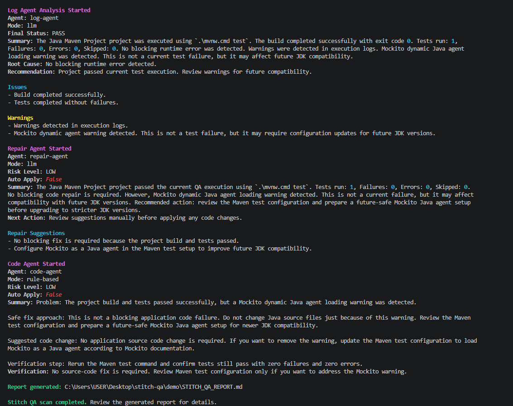

# Stitch QA

[](https://github.com/hashan-7/stitch-qa/releases)
[](https://github.com/hashan-7/stitch-qa/actions)
[](https://opensource.org/licenses/MIT)

**Stitch QA** is an AI-assisted pre-deployment QA tool for Python and Java Maven projects.

It scans a project, detects the supported execution profile, runs tests when possible, analyzes runtime evidence, reviews source-code risks, prepares repair guidance, and generates professional Markdown and JSON QA reports. Stitch QA is designed to support developer review before deployment; it does **not** automatically modify source code.

---

## Why Stitch QA?

Most projects fail before deployment for predictable reasons: missing validation, failing tests, unclear logs, weak test coverage, unsupported runtime environments, and incomplete release evidence.

Stitch QA helps developers quickly answer:

- What type of project is this?
- Can the test workflow run safely?
- Did the test suite pass or fail?
- What is the most likely root cause?
- Which files and symbols are affected?
- Is this safe to release?
- What should be fixed first?
- How should the fix be verified?

---

## Current Capabilities

| Area | Capability |
| --- | --- |
| Project discovery | Detects supported Python and Java Maven projects |
| Python execution | Runs pytest-based projects when compatible tests are found |
| Java execution | Runs Maven test workflows when Maven or Maven Wrapper is available |
| Source quality review | Reviews supported application source files for evidence-backed risks |
| Runtime evidence analysis | Parses structured test evidence where available and explains failures |
| Repair planning | Produces prioritized, evidence-linked repair contracts |
| Repair assurance | Provides code-level implementation guidance without applying patches |
| Unsupported projects | Exits cleanly for unsupported project types without fake analysis |
| Reports | Generates Markdown and JSON reports |
| Safety | Keeps Auto Apply disabled and requires manual developer review |

---

## Supported Project Types

| Project Type | Status | Notes |
| --- | --- | --- |
| Python + pytest | Supported | Detects pytest-compatible tests and runs `python -m pytest` |
| Python source-only | Supported with limited runtime evidence | Source review still runs; runtime QA is skipped when no compatible tests are found |
| Java Maven | Supported | Uses Maven or Maven Wrapper when available |
| PHP Composer | Planned | Detected and skipped cleanly in the current version |
| Java Gradle | Planned | Not executed in the current version |
| Node.js / TypeScript | Planned | Not executed in the current version |
| Go | Planned | Not executed in the current version |
| Rust | Planned | Not executed in the current version |
| C# .NET | Planned | Not executed in the current version |

---

## How the QA Flow Works

```text
Project folder
    ↓
Project scanner
    ↓
Execution profile detection
    ↓
Source Quality Intelligence Analyst
    ↓
Validated test execution, when supported and available
    ↓
Runtime Quality Intelligence Analyst
    ↓
Defect Resolution Intelligence Analyst
    ↓
Repair Assurance Intelligence Analyst
    ↓
Markdown + JSON QA reports
```

---

## AI Agent Architecture

| Agent | Role | Output |
| --- | --- | --- |
| Source Quality Intelligence Analyst | Reviews supported application source files for source-level risks | Source findings, risk level, release recommendation |
| Runtime Quality Intelligence Analyst | Analyzes validated runtime and test evidence | Runtime status, root cause groups, release gate |
| Defect Resolution Intelligence Analyst | Converts confirmed findings into prioritized repair contracts | Repair priority, objective, strategy, verification guidance |
| Repair Assurance Intelligence Analyst | Converts repair contracts into code-level guidance | Target files, target symbols, change boundary, verification plan |

---

## Installation

### Install from GitHub

```bash
pip install git+https://github.com/hashan-7/stitch-qa.git
```

### Install locally for development

```bash
git clone https://github.com/hashan-7/stitch-qa.git
cd stitch-qa
python -m venv .venv

# Linux / macOS
source .venv/bin/activate

# Windows PowerShell
.\.venv\Scripts\Activate.ps1

python -m pip install --upgrade pip
python -m pip install -e ./cli
```

---

## Quick Start

### Scan a project only

```bash
stitch scan .
```

### Scan and run tests

```bash
stitch scan . --run
```

### Scan, run, and analyze test evidence

```bash
stitch scan . --run --analyze
```

### Full QA flow with repair guidance

```bash
stitch scan . --run --analyze --repair
```

---

## Example: Python Project with Failing Tests

```bash
stitch scan test-project --run --analyze --repair
```

Expected high-level result:

```text
Detected Type: Python Project
Execution Profile: PYTHON_PYTEST
Test Summary: Total=4, Passed=2, Failed=2
Failure Origin: APPLICATION_DEFECT
Final QA Status: BLOCK_RELEASE
```

Stitch QA groups related runtime failures with source-quality findings and prepares a focused repair contract instead of producing broad or unrelated recommendations.

---

## Example: Python Source-Only Project

```bash
stitch scan test-project-python-source-only --run --analyze --repair
```

Expected high-level result:

```text
Detected Type: Python Project
Has Tests: False
Runtime Quality Intelligence: NOT_RUN
QA Evidence Completeness: SOURCE_ONLY
Final QA Status: QA_INCOMPLETE
```

When no compatible tests are detected, Stitch QA does not invent runtime results. It still performs source review and provides safe guidance based on available evidence.

---

## Example: Java Maven Project

```bash
stitch scan test-project-maven --run --analyze --repair
```

If Maven is unavailable, Stitch QA classifies the issue as an environment blocker:

```text
Failure Origin: ENVIRONMENT
Required Action: Install Maven or provide a valid Maven Wrapper
Guidance Status: NO_CODE_CHANGE_REQUIRED
Final QA Status: QA_INCOMPLETE
```

Stitch QA does not recommend application source-code changes for environment-only failures.

---

## Example: Unsupported Project

```bash
stitch scan test-project-php-unsupported --run --analyze --repair
```

Expected high-level result:

```text
Detected Type: PHP Composer Project
Skipping execution. This project type is not yet supported in this version.
Supported: Java Maven, Python
Exiting cleanly with exit code 0.
```

Unsupported project handling is intentionally safe. Stitch QA does not run fake Agent 1, Agent 2, or Agent 3 analysis for unsupported languages.

---

## Reports

After a scan, Stitch QA generates reports inside the scanned project folder:

```text
STITCH_QA_REPORT.md
STITCH_QA_REPORT.json
```

Reports may include:

- Project summary
- Detected project type
- Static mapping
- Source review findings
- Test execution result
- Runtime root-cause analysis
- Repair contracts
- Repair assurance guidance
- Final QA decision
- Evidence and limitations

---

## Final QA Status Values

| Status | Meaning |
| --- | --- |
| `READY_WITH_CAUTION` | No blocking issue was found from available evidence, but this does not prove complete correctness |
| `REVIEW_REQUIRED` | A risk or incomplete signal requires developer review |
| `QA_INCOMPLETE` | Runtime or validation evidence is incomplete |
| `BLOCK_RELEASE` | Confirmed failure evidence blocks release until fixed and verified |

---

## Docker Usage

Build a local Docker image:

```bash
docker build -t stitch-qa:local .
```

Run Stitch QA against a project folder:

```bash
docker run --rm -v "${PWD}:/project" stitch-qa:local scan /project --run --analyze --repair
```

On Windows PowerShell:

```powershell
docker run --rm -v "${PWD}:/project" stitch-qa:local scan /project --run --analyze --repair
```

---

## GitHub Actions Usage

Stitch QA can run inside a GitHub Actions workflow.

```yaml
name: Stitch QA Scan

on:
  push:
    branches: [dev, main]
  pull_request:
    branches: [dev, main]
  workflow_dispatch:

jobs:
  stitch-qa:
    runs-on: ubuntu-latest

    steps:
      - name: Checkout
        uses: actions/checkout@v4

      - name: Run Stitch QA
        uses: ./
        with:
          project-path: "."
          run-tests: "true"
          analyze: "true"
          repair: "true"

      - name: Upload Stitch QA reports
        uses: actions/upload-artifact@v4
        with:
          name: stitch-qa-reports
          path: "**/STITCH_QA_REPORT.*"
```

---

## Basic Commands

| Command | Description |
| --- | --- |
| `stitch scan .` | Scan the project and show detected structure |
| `stitch scan . --run` | Scan and run the supported test command |
| `stitch scan . --run --analyze` | Scan, run tests, and analyze runtime evidence |
| `stitch scan . --run --analyze --repair` | Run the full QA flow and produce repair guidance |
| `stitch analyze-code` | Analyze a single code snippet manually |

---

## Requirements

| Requirement | Version / Notes |
| --- | --- |
| Python | 3.10+ |
| Java | 17+ for Java projects |
| Maven | 3.6+ or Maven Wrapper for Java Maven execution |
| Docker | Optional |
| Git | Required for source installation |
| pytest | Required inside Python projects that need runtime test execution |

---

## Safety Guarantees

Stitch QA is designed as a QA guidance tool, not an automatic code modifier.

- It does not automatically change project source code.
- Auto Apply remains disabled.
- AI-generated guidance must be reviewed by a developer.
- Unsupported project types are skipped cleanly.
- Environment failures are not mixed with application defects.
- Reports include limitations when evidence is incomplete.

---

## Development Checks

Recommended local validation commands:

```bash
python -m pytest agents/code-agent/tests/test_code_agent.py agents/repair-agent/tests/test_repair_agent.py cli/tests/test_repair_guidance_v2.py -q

stitch scan test-project --run --analyze --repair
stitch scan test-project-python-source-only --run --analyze --repair
stitch scan test-project-maven --run --analyze --repair
stitch scan test-project-php-unsupported --run --analyze --repair
```

Expected acceptance behavior:

| Fixture | Expected Result |
| --- | --- |
| `test-project` | Python pytest failure is detected; final status is `BLOCK_RELEASE` |
| `test-project-python-source-only` | Runtime QA is skipped; final status is `QA_INCOMPLETE` |
| `test-project-maven` | Maven-unavailable case is classified as `ENVIRONMENT` |
| `test-project-php-unsupported` | Unsupported PHP project exits cleanly with code 0 |

---

## Roadmap

| Area | Status |
| --- | --- |
| Python pytest support | Available |
| Java Maven support | Available |
| Docker execution support | Available |
| GitHub Actions support | Available |
| Unsupported project clean-exit UX | Available |
| Gradle support | Planned |
| Node.js / TypeScript support | Planned |
| PHP Composer execution support | Planned |
| Go, Rust, and .NET support | Planned |
| Patch generation with guarded validation | Future research |

---

## Screenshots

Keep screenshots only when they match the current CLI output and are stored in the repository.

Recommended image usage:

```markdown

```

Avoid screenshots that show outdated agent names, old commands, removed flags, broken links, private tokens, local machine paths, or temporary debug output.

---

## License

This project is licensed under the MIT License. See [`LICENSE`](LICENSE) for details.

---

## Acknowledgments

Stitch QA is built with Python and open-source developer tooling, including FastAPI, Click, Rich, pytest, and related ecosystem packages.

---

<div align="center">Developed with 💜 by H7</a></div>