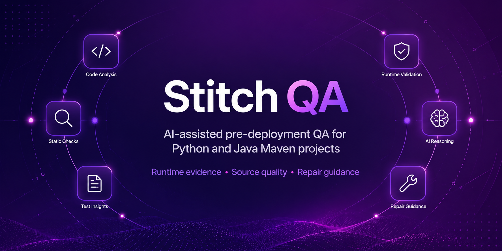

<p align="center">
  
</p>

# Stitch QA

[](https://github.com/hashan-7/stitch-qa/releases)
[](https://github.com/hashan-7/stitch-qa/actions)
[](https://opensource.org/licenses/MIT)

**Stitch QA** is an AI-assisted pre-deployment QA tool that turns project structure, source review, test execution, runtime evidence, and repair planning into clear release guidance.

It is built for developers who need a safe review layer before shipping. Stitch QA discovers supported project profiles, runs validated checks where possible, explains failures, separates application defects from environment blockers, and produces Markdown and JSON QA reports for human review.

Stitch QA is deliberately advisory. It does **not** automatically modify project source code, and **Auto Apply is always `False`**.

---

## Table of Contents

- [What Stitch QA Delivers](#what-stitch-qa-delivers)
- [Supported Project Types](#supported-project-types)
- [QA Flow](#qa-flow)
- [AI Agent Architecture](#ai-agent-architecture)
- [Installation](#installation)
- [Quick Start](#quick-start)
- [Reports](#reports)
- [Final QA Status](#final-qa-status)
- [Docker Usage](#docker-usage)
- [GitHub Actions Usage](#github-actions-usage)
- [Basic Commands](#basic-commands)
- [Requirements](#requirements)
- [Safety Guarantees](#safety-guarantees)
- [Development Checks](#development-checks)
- [Roadmap](#roadmap)
- [License](#license)
- [Acknowledgments](#acknowledgments)

---

## What Stitch QA Delivers

| Capability | Description |
| --- | --- |
| Project discovery | Detects supported project structure and maps source, test, and build locations. |
| Safe execution profile selection | Chooses a supported built-in execution path instead of running arbitrary shell commands. |
| Python pytest validation | Runs pytest workflows when compatible Python tests are detected. |
| Python source-only handling | Runs source-quality review even when no compatible tests are available. |
| Java Maven validation | Supports Maven-based Java projects when Maven or Maven Wrapper is available. |
| Source-quality review | Reviews supported application source files for evidence-backed risks. |
| Runtime evidence analysis | Uses structured test evidence where available and explains runtime failures. |
| Failure classification | Separates application defects, missing test evidence, unsupported project types, and environment blockers. |
| Repair contracts | Converts confirmed findings into prioritized repair objectives with boundaries and verification steps. |
| Repair assurance | Provides implementation-level guidance for repair contracts without applying patches. |
| Release decision support | Produces a final QA status, risk level, release recommendation, and evidence-completeness signal. |
| Report generation | Writes Markdown and JSON reports for release review and CI artifacts. |

---

## Supported Project Types

| Project Type | Status | Current Behavior |
| --- | --- | --- |
| Python + pytest | Supported | Detects compatible tests and runs the supported pytest workflow. |
| Python source-only | Supported with limited evidence | Runs source-quality review; runtime execution and Runtime Quality Intelligence are not invented. |
| Java Maven | Supported | Runs the supported Maven test workflow when Maven or Maven Wrapper is available. |
| PHP Composer | Planned | Detected and skipped cleanly in the current version. |
| Java Gradle | Planned | Not executed in the current version. |
| Node.js / TypeScript | Planned | Not executed in the current version. |
| Go | Planned | Not executed in the current version. |
| Rust | Planned | Not executed in the current version. |
| .NET | Planned | Not executed in the current version. |

> **Current multi-language behavior:** If a repository contains multiple supported project indicators, Stitch QA currently selects one primary supported execution profile for the scan. Full multi-profile execution for mixed-language repositories is planned for a future version.

---

## QA Flow

```text
Project folder
    ↓
Project scanner and supported profile detection
    ↓
Static mapping and source/test discovery
    ↓
Source Quality Intelligence Analyst
    ↓
Supported test execution, when available
    ↓
Runtime Quality Intelligence Analyst
    ↓
Defect Resolution Intelligence Analyst
    ↓
Repair Assurance Intelligence Analyst
    ↓
Markdown and JSON QA reports
    ↓
Final QA decision
```

Stitch QA does not fabricate missing evidence. If no compatible tests are detected, the runtime path is marked incomplete instead of being guessed. If an environment tool such as Maven is unavailable, the issue is classified as an environment blocker rather than an application-source defect.

---

## AI Agent Architecture

| Agent | Responsibility | Typical Output |
| --- | --- | --- |
| Source Quality Intelligence Analyst | Reviews supported application source files for source-level risks. | Source findings, risk level, release recommendation, limitations. |
| Runtime Quality Intelligence Analyst | Interprets validated test and runtime evidence. | Execution status, root-cause groups, failure origin, release gate. |
| Defect Resolution Intelligence Analyst | Converts relevant findings into prioritized repair contracts. | Priority, repair objective, change boundary, protected behavior, verification plan. |
| Repair Assurance Intelligence Analyst | Provides implementation-level assurance for repair contracts. | Target files, target symbols, code-level approach, regression verification. |

The agents are evidence-led. Repair guidance is produced only from supplied Stitch QA findings and runtime evidence. When no repair target exists, Stitch QA reports that no repair is required.

---

## Installation

### Clone the repository

```bash
git clone https://github.com/hashan-7/stitch-qa.git
cd stitch-qa
python -m venv .venv
```

### Activate the virtual environment

Linux or macOS:

```bash
source .venv/bin/activate
```

Windows PowerShell:

```powershell
.\.venv\Scripts\Activate.ps1
```

### Install the CLI locally

```bash
python -m pip install --upgrade pip
python -m pip install -e ./cli
```

For Java Maven projects, install Maven or provide a working Maven Wrapper. For Python runtime validation, make sure pytest is available in the environment used to run the scanned project.

---

## Quick Start

Run from the project you want to assess, or provide a project path explicitly.

### Scan project structure only

```bash
stitch scan .
```

### Run the supported test workflow

```bash
stitch scan . --run
```

### Add runtime evidence analysis

```bash
stitch scan . --run --analyze
```

### Run the full review workflow with repair guidance

```bash
stitch scan . --run --analyze --repair
```

---

## Example Outcomes

### Passing Python pytest project

```text
Detected Type: Python Project
Execution Profile: PYTHON_PYTEST
Test Result: PASS
Release Gate: ALLOW_RELEASE
Final QA Status: PASS_WITH_WARNINGS
```

A passing test workflow does not prove complete software correctness. It means the validated tested scope did not produce blocking runtime evidence.

### Python project with failing tests

```text
Detected Type: Python Project
Test Result: FAIL
Failure Origin: APPLICATION_DEFECT
Release Gate: BLOCK_RELEASE
Final QA Status: BLOCK_RELEASE
```

Stitch QA groups related runtime failures and source findings into repair contracts so the developer can focus on the affected behavior.

### Python source-only project

```text
Detected Type: Python Project
Has Tests: False
Runtime Quality Intelligence: NOT_RUN
QA Evidence Completeness: SOURCE_ONLY
Final QA Status: QA_INCOMPLETE
```

Source-only projects still receive source-quality review, but runtime behavior is not claimed without test evidence.

### Java Maven environment blocker

```text
Detected Type: Java Maven Project
Execution Status: FAILED_TO_START
Failure Origin: ENVIRONMENT
Guidance Status: NO_CODE_CHANGE_REQUIRED
Final QA Status: QA_INCOMPLETE
```

Maven availability problems are not treated as application defects. Stitch QA recommends restoring the build/test environment first.

### Unsupported project

```text
Detected Type: PHP Composer Project
Skipping execution. This project type is not yet supported in this version.
Exiting cleanly with exit code 0.
```

Unsupported projects are handled safely. Stitch QA does not run simulated runtime, repair, or assurance analysis for unsupported languages.

---

## Reports

After a QA workflow, Stitch QA writes reports to the scanned project directory:

```text
STITCH_QA_REPORT.md
STITCH_QA_REPORT.json
```

Reports may include:

- Project type and static mapping
- Supported execution profile
- Source review discovery and findings
- Test execution result
- Runtime evidence summary
- Runtime root-cause groups
- Repair contracts
- Repair assurance guidance
- Final QA status
- Risk level
- Release recommendation
- Evidence completeness
- Limitations and verification steps

The Markdown report is designed for human review. The JSON report is designed for CI, automation, and structured comparison.

---

## Final QA Status

| Status | Meaning |
| --- | --- |
| `PASS_WITH_WARNINGS` | The validated tested scope passed, with standard QA limitations still documented. |
| `READY_WITH_CAUTION` | Available evidence did not find a blocking source issue, but this is not a guarantee of complete correctness. |
| `REVIEW_REQUIRED` | A risk, uncertainty, or incomplete signal requires developer review. |
| `QA_INCOMPLETE` | Runtime or validation evidence is unavailable, skipped, or incomplete. |
| `BLOCK_RELEASE` | Confirmed failure evidence blocks release until remediation and verification. |
| `SKIPPED` | The project type is unsupported or not applicable for the current execution path. |

---

## Docker Usage

Build the local image from the repository root:

```bash
docker build -t stitch-qa:local .
```

Run Stitch QA against the current directory:

```bash
docker run --rm -v "${PWD}:/project" stitch-qa:local scan /project --run --analyze --repair
```

Windows PowerShell:

```powershell
docker run --rm -v "${PWD}:/project" stitch-qa:local scan /project --run --analyze --repair
```

The containerized workflow is useful for repeatable CLI execution. Generated reports are written into the mounted project directory.

---

## GitHub Actions Usage

Stitch QA can run from a GitHub Actions workflow. A minimal local-action example:

```yaml
name: Stitch QA

on:
  push:
    branches: [main, dev]
  pull_request:
    branches: [main, dev]
  workflow_dispatch:

jobs:
  qa:
    runs-on: ubuntu-latest

    steps:
      - name: Checkout
        uses: actions/checkout@v4

      - name: Run Stitch QA
        uses: ./
        with:
          project-path: .

      - name: Upload Stitch QA reports
        uses: actions/upload-artifact@v4
        with:
          name: stitch-qa-reports
          path: "**/STITCH_QA_REPORT.*"
```

Review both workflow logs and generated reports before making release decisions.

---

## Basic Commands

| Command | Description |
| --- | --- |
| `stitch scan <path>` | Discover the project and show detected structure. |
| `stitch scan <path> --run` | Run source review and the supported test workflow when applicable. |
| `stitch scan <path> --run --analyze` | Add runtime evidence analysis. |
| `stitch scan <path> --run --analyze --repair` | Add repair contracts and repair-assurance guidance. |
| `stitch analyze-code` | Start the standalone repair-assurance prompt. |

Use quotes when the project path contains spaces:

```powershell
stitch scan "test multi project" --run --analyze --repair
```

---

## Requirements

| Requirement | Notes |
| --- | --- |
| Python | Python 3.11 or later is recommended for Stitch QA development. |
| pytest | Required inside Python projects that need runtime test execution. |
| Java | Required for Java Maven projects. |
| Maven or Maven Wrapper | Required for Java Maven execution. |
| Docker | Optional, for containerized use. |
| Git | Required when installing from a repository checkout. |

---

## Safety Guarantees

- Stitch QA does not automatically modify project source code.
- Auto Apply is always `False`, including CLI and report output.
- AI-assisted output is guidance for developer review, not a guarantee that software is bug-free.
- Unsupported project types are skipped cleanly.
- Environment blockers are kept distinct from application defects.
- Runtime results are not invented when tests are missing or not executed.
- Repair guidance is bounded to supplied evidence and includes verification steps.
- Generated reports document limitations when evidence is incomplete.

---

## Development Checks

The following checks are intended for contributors and release validation.

```bash
python -m pytest agents/code-agent/tests/test_code_agent.py agents/repair-agent/tests/test_repair_agent.py cli/tests/test_repair_guidance_v2.py -q
```

Broader local validation:

```bash
python -m pytest agents/code-agent/tests agents/log-agent/tests agents/repair-agent/tests cli/tests tests -q -p no:cacheprovider
```

Recommended acceptance scenarios:

| Scenario | Expected Result |
| --- | --- |
| Python pytest with passing tests | Final status `PASS_WITH_WARNINGS`; repair guidance `NOT_REQUIRED`. |
| Python pytest with failing tests | Application defect detected; final status `BLOCK_RELEASE`. |
| Python source-only project | Runtime QA `NOT_RUN`; final status `QA_INCOMPLETE`. |
| Java Maven with Maven unavailable | Failure origin `ENVIRONMENT`; no application source change required. |
| Unsupported PHP Composer project | Clean skip with exit code 0; no simulated agent analysis. |
| Mixed Java + Python project | Current version selects one primary supported execution profile. |

Do not modify validation fixtures or generated `STITCH_QA_REPORT` files solely to make checks pass.

---

## Roadmap

| Area | Direction |
| --- | --- |
| Python pytest support | Available today. |
| Python source-only guidance | Available today. |
| Java Maven support | Available today. |
| Unsupported-project clean exit | Available today. |
| Multi-profile mixed-language execution | Planned for a future version. |
| Gradle support | Planned. |
| Node.js / TypeScript support | Planned. |
| PHP Composer execution support | Planned. |
| Go, Rust, and .NET support | Planned. |
| Guarded patch generation and validation | Future research. |

---

## License

This project is licensed under the MIT License. See [`LICENSE`](LICENSE) for details.

---

## Acknowledgments

Stitch QA is built with Python and open-source developer tooling, including Click, Rich, pytest, FastAPI, Docker, and the broader QA automation ecosystem.

---

<div align="center">

**Developed with 💜 by H7**

</div>
